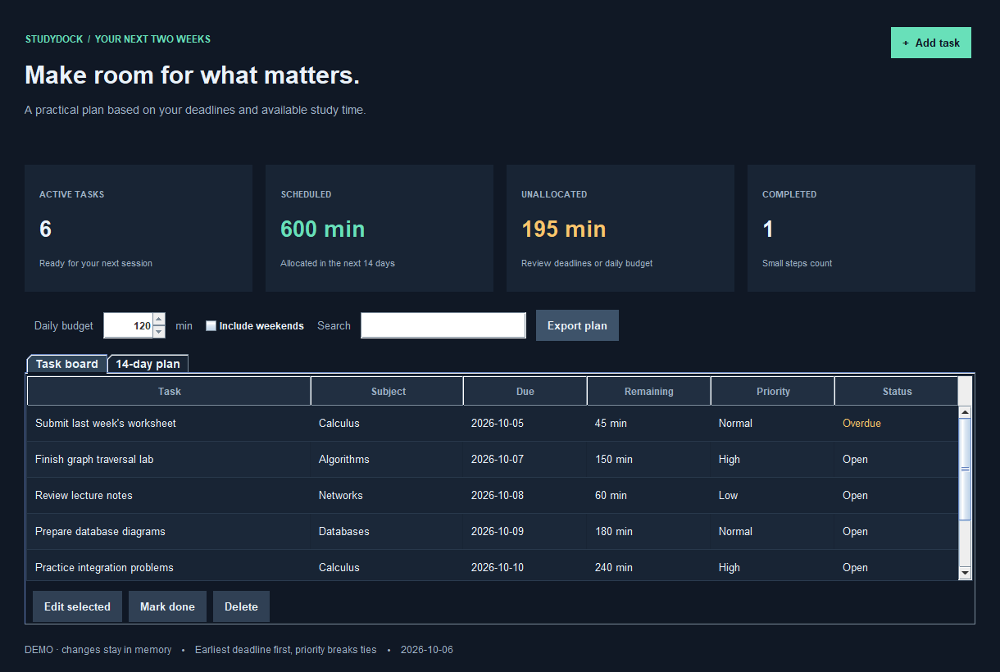

<div align="center">

# StudyDock
### Make room for what matters.

**Java 21 · Swing desktop app · Deadline-aware planning · Local storage**

[](https://github.com/LunniyJomolungma/studydock/actions/workflows/ci.yml)

[Quick start](#quick-start) · [Planning rules](#planning-rules) · [Design notes](docs/DESIGN.md) · [Roadmap](docs/ROADMAP.md)

</div>



## A task list should tell you what fits

Knowing that a lab is due on Friday is useful. Knowing whether it fits into the time you actually have is better. StudyDock allocates remaining work across the next two weeks and calls out tasks that cannot fit before their deadlines.

## Features

| Task board | Planning | Local workflow |
| --- | --- | --- |
| Add, edit, complete and delete tasks | Earliest-deadline-first allocation | Versioned UTF-8 storage |
| Subject, deadline, remaining minutes and priority | Configurable daily budget | Temporary-file replacement on save |
| Search by title or subject | Optional weekend study | One-writer file lock |
| Overdue and completed states | Blocks up to 60 minutes | CSV export of blocks and shortfalls |
| Separate demo mode | Explicit unallocated-work warnings | No accounts or network requests |

## Quick start

Install a **JDK 21 or newer** and verify `java -version` and `javac -version`. There are no Maven dependencies, downloads during the build or third-party UI libraries.

### Windows / PowerShell

```powershell
./build.ps1 -Test
java -jar build/studydock.jar --demo
```

The script uses `JAVA_HOME` when set, otherwise Java tools on `PATH`.

### Linux / macOS

```sh
sh build.sh test
java -jar build/studydock.jar --demo
```

Omit `--demo` to open your own task board:

```sh
java -jar build/studydock.jar
```

Run from the project directory so the same `data/tasks.tsv` is used each time. A desktop environment is required for the app; the tests run headlessly. VS Code can open the project directory directly.

## Try this workflow

1. Launch demo mode. Demo changes stay in memory.
2. Reduce the daily budget and watch the unallocated-work total increase.
3. Open **14-day plan** to see the actual day-by-day blocks.
4. Enable weekends to see how additional capacity changes the plan.
5. Create your own task, give it a deadline and estimate the remaining minutes.
6. Export the plan as CSV or mark a finished task done.

## Planning rules

- Active tasks are sorted by deadline, then priority, then title and ID.
- Each task takes the earliest available time up to and including its deadline.
- The daily budget is never exceeded. Work is split into blocks of at most 60 minutes.
- Overdue tasks are left unallocated and called out explicitly.
- Tasks beyond the 14-day window can use available time in the current window; remaining work is identified separately from a missed deadline.
- Zero remaining minutes means completed. Planned sessions do not automatically reduce remaining work.

This is an explainable allocation heuristic, not an optimal calendar scheduler. There are no time-of-day slots, course timetables, reminders or interval-repetition claims.

## Your data

Personal task data lives in `data/`, which is ignored by Git. It is plain local data, not encrypted. Demo mode does not read or write it. A versioned TSV format uses Base64 for text fields, allowing Unicode and punctuation without ambiguous delimiters.

An unreadable or malformed file stops startup rather than silently replacing data. Saves use a temporary file and atomic replacement where supported, falling back to regular replacement otherwise. An OS file lock prevents two app instances from editing the same file simultaneously. Keep backups of important data.

## Project layout

```text
src/main/java/studydock/
  Task.java        # validated task record
  Planner.java     # pure scheduling logic
  TaskStore.java   # persistence and locking
  PlanExport.java  # CSV export
  Demo.java        # sample tasks
  StudyDock.java   # Swing interface and entry point
src/test/java/studydock/Tests.java
docs/              # preview, design and roadmap
build.ps1 / build.sh
```

## Verification

Tests cover daily capacity, inclusive deadlines, priority tie-breaking, weekend exclusion, overdue tasks, Unicode persistence, concurrent access, corrupted files and CSV quoting. An additional 100 generated task sets check that no work disappears and no block is placed after its deadline.

The README image is a deterministic rendering of the real Swing panel, not a separately drawn mockup. Fonts and window decorations can differ by operating system.

## Development notes

Written from scratch with AI assistance. Existing study-planner READMEs were used only to understand the general product category. No source code, images or third-party libraries were copied into this project. See [provenance](docs/PROVENANCE.md) and the [roadmap](docs/ROADMAP.md). No license has been selected for this repository yet.
